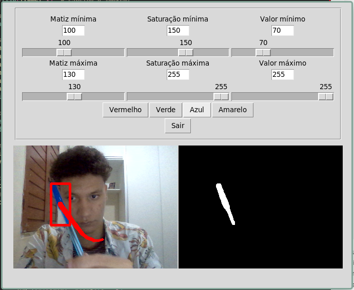
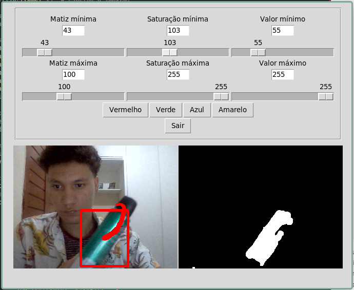
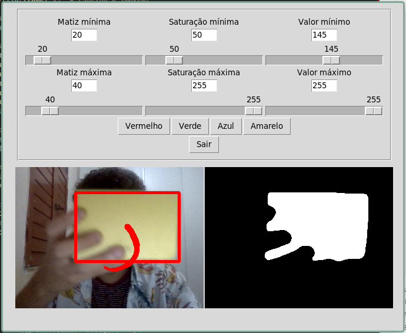

# Relatório

---

## Missão

- [x] Detectar objetos por cor.
- [x] Desenhar um retângulo em volta do objeto detectado.
- [x] Exibir uma parte da trajetória do objeto detectado.
- [x] Código comentado.

## Introdução

O projeto escolhido foi o de detecção de objetos por cor. Consiste em criar um programa com interface gráfica na qual seja possível visualizar tanto a detecção (desenhar o retângulo em volta do objeto detectado) quanto a trajetória de um objeto de uma cor específica. Para isso, foi utilizado o OpenCV para a detecção de objetos e o Tkinter para a interface gráfica.

## Desenvolvimento

A escolha do Tkinter para a interface gráfica se deu por ser uma biblioteca nativa do Python, que permite a criação de interfaces gráficas de forma simples e rápida. Além disso, eu já tinha um experiência mínima com a biblioteca, o que facilitou o desenvolvimento do projeto. Contudo, não pude extrair o máximo do design do código para tornar mais manutenível utilizando orientação a objetos. Apesar disso, acredito que o código esteja bem comentado e fácil de entender.

### Exemplo







Irei explicar a parte mais importante do código na qual é feita a detecção do objeto, a trajetória e o desenho do retângulo em volta do objeto.

```python
def showFrame():
    # Função para exibir o frame normal e o frame com a máscara.
    sucess, frame = cam.read()  # Captura a imagem como um numpy array.

    frame = cv2.flip(frame, 1)  # Espelha a imagem.

    # Transforma a imagem em HSV e aplica um blur.
    hsv = cv2.GaussianBlur(cv2.cvtColor(frame, cv2.COLOR_BGR2HSV), (11, 11), 0)

    # Cria a máscara com base nos valores dos sliders.
    rangeMin = np.array(
        [colorValues["Matiz Mínima"].get(), colorValues["Saturação Mínima"].get(),
         colorValues["Valor Mínimo"].get()])
    rangeMax = np.array(
        [colorValues["Matiz Máxima"].get(), colorValues["Saturação Máxima"].get(),
         colorValues["Valor Máximo"].get()])
    mask = cv2.inRange(hsv, rangeMin, rangeMax)

    # Aplica erosão e dilatação para remover ruídos.
    mask = cv2.erode(mask, None, iterations=2)
    mask = cv2.dilate(mask, None, iterations=2)

    # Aplica a máscara na imagem.
    contours, hierarchy = cv2.findContours(
        mask, cv2.RETR_EXTERNAL, cv2.CHAIN_APPROX_SIMPLE)

    if contours:
        for contour in contours:
            # Se o contorno for maior que o mínimo, desenha o retângulo.
            if cv2.contourArea(contour) > MIN_AREA_CONTOUR:
                x, y, w, h = cv2.boundingRect(contour)
                cv2.rectangle(frame, (x, y), (x+w, y+h), (0, 0, 255), 3)
                center = (x + w//2, y + h//2)  # Ponto central do retângulo.
                points.append(center)

                # Para cada ponto, desenha uma linha entre ele e o anterior.
                for i in np.arange(1, len(points)):
                    if points[i - 1] is None or points[i] is None:
                        continue
                    thickness = int(np.sqrt(float(i + 1) / BUFFER_SIZE) * 10)
                    cv2.line(frame, points[i - 1],
                             points[i], (0, 0, 255), thickness)

    # Se não houver contornos, não há pontos, portanto, limpa a lista.
    if not contours:
        points.clear()
```

A função `showFrame()` é chamada a cada 15ms para atualizar os frames. Primeiramente, é capturado o frame da câmera e aplicado um flip para espelhar a imagem, para deixar mais natural, como em um espelho de verdade. Em seguida, a imagem é transformada para o espaço de cores HSV e aplicado um blur para suavizar a imagem. Após isso, é criada a máscara com base nos valores dos sliders. A máscara é aplicada na imagem e, em seguida, é feita a erosão e dilatação para remover ruídos. Após isso, é feita a detecção de contornos na máscara. Se houver contornos, é feito um loop para cada ponto contorno, é importante observar que a forma como o contorno é achado é utilizando o Chain Approximation Simple, que é uma técnica de aproximação de contornos, para retornar somente os contornos necessários, evitando um alto uso de memória. Se o contorno for maior que o mínimo, é desenhado um retângulo em volta do objeto. O ponto central do retângulo é adicionado a uma lista de pontos. Para cada ponto, é desenhada uma linha entre ele e o anterior. Se não houver contornos, a lista de pontos é limpa. Perceba que a função não está completa, pois o restante é apenas para a exibição dos frames no Tkinter.

## Conclusão

O projeto foi bem desafiador de início, porém a biblioteca do OpenCV é bem completa e possui muitos exemplos, o que facilitou o desenvolvimento do projeto. O que mais me desafiou mesmo foi pôr as capturas de vídeo no Tkinter. Apesar disso, foi bem divertido e aprendi bastante, gostaria de ter implementado a orientação com objetos no tkinter já que deixaria o código bem mais organizado do que esse, mas estava me complicando demais do que simplificando e acabei deixando de lado.
