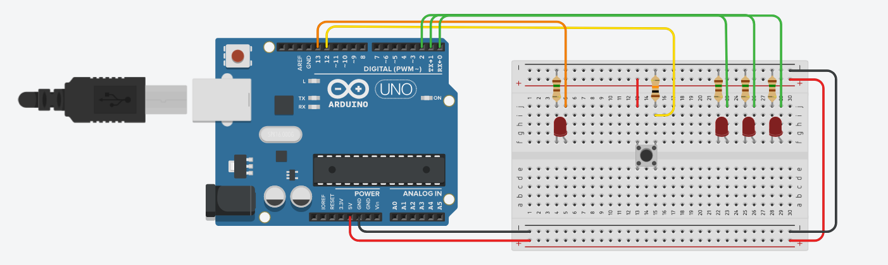

# Relatório de circuito com Arduino Uno R3, leds e botão

---

# Missão

[x] Montar um circuito com Arduino para fazer um led piscar em 3 períodos diferentes.

## Introdução

O objetivo deste relatório é apresentar o circuito desenvolvido no TinkerCAD, que utiliza um Arduino Uno R3, 4 leds, 1 botão, 4 resistores de 150 ohms e 1 resistor de 10 kohms. O circuito foi desenvolvido para demonstrar três modos diferentes no led conectado ao pino 13 do Arduino. Além disso, os outros três leds servem para indicar qual modo está em funcionamento. O botão, por sua vez, é utilizado para alterar o modo de piscada do led.

## Materiais utilizados

Faça uma tabela

| Nome | Quantidade | Componente |
|:----:|:----------:|:----------:|
| UArduino | 1 | Arduino Uno R3 |
| Dn | 4 | Red Led |
| Rn | 4 | 150 ohms |
| R1 | 1 | 10 kohms |
| S1 | 1 | Push Button |

## Descrição do circuito

O circuito foi montado conforme a figura abaixo:

O circuito pode ser acessado [aqui](https://)

## Circuito do Arduino Uno R3

Os leds estão conectados aos pinos 13, 2, 1 e 0 do Arduino, enquanto o botão está conectado ao pino 12. Cada led possui um resistor de 150 ohms em série para limitar a corrente que passa pelo circuito. Já o botão possui um resistor de 10 kohms em série para evitar que haja corrente excessiva passando pelo circuito quando o botão é pressionado.
Funcionamento do circuito

O programa desenvolvido para o Arduino faz com que o led conectado ao pino 13 pisque em três modos diferentes: constante, desligado e piscada normal. A cada vez que o botão é pressionado, o modo de piscada é alterado. Os leds conectados aos pinos 2, 1 e 0 servem para indicar qual modo está em funcionamento.

- Quando o led conectado ao pino 2 está aceso, o modo constante está ativado.
- Quando o led conectado ao pino 1 está aceso, o modo desligado está em funcionamento.
- Quando o led conectado ao pino 0 está aceso, o modo de piscada dupla está em funcionamento.

## Conclusão

O circuito desenvolvido foi além do que foi proposto, pois bastava ligar apenas um único led e programá-lo para 3 modos diferentes. Contudo, me empolguei e decidi fazer um circuito mais elaborado, isso me exigiu que eu pesquisasse mais sobre o funcionamento dos botões e da própria Arduino IDE. Existem algumas coisas a mais que podem ser implementadas no código para melhorá-lo, como um ajuste melhor na leitura do botão para que ele possa ser mais preciso e evitar que o modo de piscada seja alterado sem querer e possibilitando uma alteração instantânea do modo de piscada, já que do jeito que está tem que pressionar para trocar no momento certo.

A ideia de fazer mais elaborado é para que eu pudesse aprender mais sobre o funcionamento do Arduino e também para que eu pudesse aprender a utilizar o TinkerCAD mesmo.
