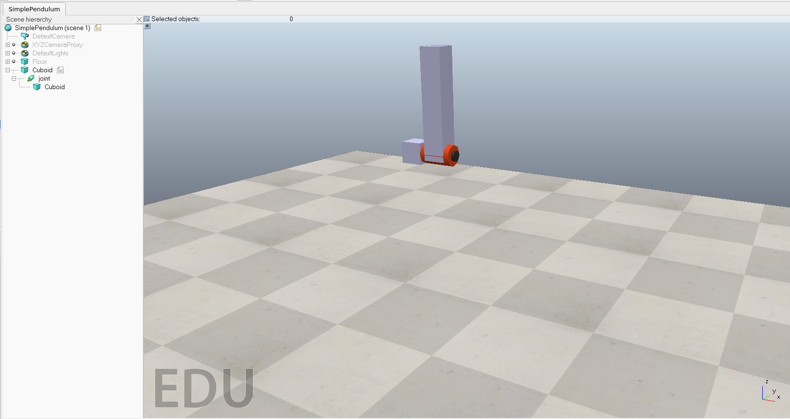

# Relatório Pêndulo Simples

---

## Objetivo

Criar um pêndulo simples no CoppeliaSim, utilizando um objetos primitivos e um Joint.

## Introdução

A cena criada no CoppeliaSim consiste em um pêndulo simples feito com um cubo que possui um revolute_joint filho chamado "joint". O joint possui outro cubo filho, que será responsável pela rotação do pêndulo.



Em seguida, foi criado o revolute_joint, chamado de _joint_, entre os dois cubóides, permitindo que o segundo cubo que é filho do joint tenha seu movimento definido a partir da rotação do joint.

A configuraçao do primeiro cubo que é pai de todos os outros objetos foi feita definindo como um objeto não dinâmico para que não seja afetado pela gravidade. Todavia, os outros objetos foram definidos como dinâmicos, para que possam ser afetados pela física do simulador. No joint, foi definido um diâmetro de 0.1m e largura de 0.15m, a posição em graus foi definida com 2 e o torque máximo de 100.

Após a configuração do joint, foi adicionado um script Lua ao ambiente do CoppeliaSim, para controlar a rotação do pêndulo. O script foi programado para fazer o cubo filho do joint rotacionar continuamente em um período de 3 segundos, variando seu ângulo entre 0 e 90 graus.

```lua
function sysCall_init()
    motor = sim.getObject("/joint") -- Pega o objeto joint
    sim.setObjectInt32Param(motor, 2001, 1) -- Habilita o controle de posição
    sim.setObjectFloatParam(motor, 2002, 2) -- Ganho de posição
    sim.setObjectFloatParam(motor, 2003, 0) -- Ganho integral
    sim.setObjectFloatParam(motor, 2004, 0) -- Ganho derivativo
    lastTime = sim.getSimulationTime()  -- Define o último tempo como o tempo atual
    sim.setJointTargetPosition(motor, 1.57) -- seta a posição inicial do joint
end

function sysCall_actuation()
    time = sim.getSimulationTime()
    rotationMotor = sim.getJointPosition(motor)
    if (rotationMotor <= 1 and (time - lastTime) > 3) then -- Se o joint estiver em 0 graus e o tempo passado for maior que 3 segundos
        lastTime = time
        sim.setJointTargetPosition(motor, 1.57)
    end
    if (rotationMotor >= 1 and (time - lastTime) > 3) then -- Se o joint estiver em 90 graus e o tempo passado for maior que 3 segundos
        lastTime = time
        sim.setJointTargetPosition(motor, 0)
    end
end
```

## Resultados da simulação

A cena foi então executada e o pêndulo simples começou a oscilar, com o cubo filho do joint girando entre 0 e 90 graus em um movimento suave e contínuo. O comportamento do pêndulo pode ser observado tanto na visualização em tempo real no CoppeliaSim, quanto na análise dos dados gerados pelo simulador.

## Conclusão

Em síntese, a cena criada no CoppeliaSim foi bem-sucedida em simular um pêndulo simples com um cubo e um revolute_joint, com o cubo filho do joint realizando uma rotação contínua entre 0 e 90 graus em um período de 3 segundos. As ch
